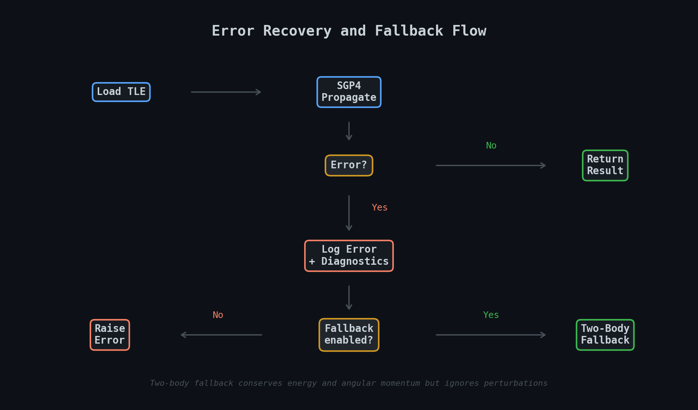

# Error Recovery and Fallback Mechanisms

## Overview

SGP4 propagation can fail for legitimate physical reasons: satellite decay, stale TLE data, numerical instability at high eccentricity. Rather than crashing, this prototype logs diagnostics with physical interpretation and optionally falls back to two-body Keplerian propagation.



---

## Error Codes

| Code | SGP4 Description | Physical Meaning | Recovery |
|------|-----------------|------------------|----------|
| 0 | No error | Propagation successful | N/A |
| 1 | Mean eccentricity out of range | Orbit may be unbound or TLE data is corrupted | Refresh TLE |
| 2 | Mean motion negative | Invalid orbital parameters | Verify TLE integrity |
| 3 | Perturbed eccentricity out of range | Propagation instability, often from extreme drag or stale TLE | Shorten propagation window |
| 4 | Semi-latus rectum negative | Unphysical orbit state | Use two-body fallback |
| 5 | Satellite decayed | Below ~98 km altitude, re-entered atmosphere | Historical data only |
| 6 | Satellite decayed (low altitude) | Same as 5, different detection path | Historical data only |

---

## How Fallback Works

When SGP4 returns a non-zero error code:

1. **Diagnostics generated.** The error code is mapped to a physical interpretation, the satellite's orbital elements at the time of error are recorded, and a recommended action is logged.
2. **Fallback attempted (if enabled).** The system retrieves the satellite's state vector at the TLE epoch (where SGP4 should still work) and initializes a two-body Keplerian propagator from that state.
3. **Result returned with flag.** The propagation result includes `fallback_used: True` and a warning message. Downstream code can check this flag to decide whether to trust the result.

### Two-body propagation properties

The fallback propagator conserves:
- **Orbital energy** (specific mechanical energy)
- **Angular momentum** (orbital plane orientation)
- **Orbital shape** (semi-major axis, eccentricity fixed)

It ignores:
- Atmospheric drag (no altitude decay)
- J2/J3/J4 perturbations (no nodal precession)
- Third-body effects (no lunar/solar perturbations)

This makes it reliable for short-term estimates (minutes to a few hours) but increasingly inaccurate over longer periods.

---

## Usage

### With automatic fallback (default)

```python
from orbit_service.live_sgp4 import LiveSGP4

sgp4 = LiveSGP4(enable_fallback=True)
norad_id = sgp4.load_satellite(line1, line2, "ISS")
result = sgp4.propagate(norad_id, timestamp)

if result['fallback_used']:
    print(f"Warning: {result['fallback_warning']}")
    # Position is approximate; use with reduced confidence
```

### Accessing error diagnostics

```python
if result['sgp4_error_code'] != 0:
    diag = result['error_diagnostics']
    print(f"Error: {diag['physical_meaning']}")
    print(f"Action: {diag['recommended_action']}")
    print(f"Orbital params: {diag['orbital_parameters']}")
```

### Error history

```python
history = sgp4.get_error_history(norad_id)
for entry in history:
    print(f"{entry['timestamp']}: {entry['error_message']}")
```

### Direct two-body propagation

```python
from orbit_service.two_body_fallback import TwoBodyFallback
import numpy as np

r0 = np.array([6778.0, 0.0, 0.0])  # km
v0 = np.array([0.0, 7.669, 0.0])   # km/s

fb = TwoBodyFallback(r0, v0)
r, v = fb.propagate(3600.0)  # 1 hour forward
```

---

## When to Enable Fallback

**Enable (default)** when you need robustness: diverse satellite populations, user-facing applications, uncertain propagation horizons.

**Disable** when accuracy matters more than availability: TLE validation, orbit determination pipelines, safety-critical assessments.

---

## Performance

| Method | Per-propagation | Notes |
|--------|----------------|-------|
| SGP4 (proven library) | ~10–50 µs | Full perturbation model |
| Two-body fallback | ~5–20 µs | Keplerian only, faster but less accurate |
| Fallback overhead | ~1–2 µs | State conversion on first fallback call |

---

## Testing

```bash
python -m pytest tests/test_error_recovery.py -v
python demo_error_recovery.py
```

---

## References

- Vallado, D. A. (2013). *Fundamentals of Astrodynamics and Applications* (4th ed.).
- Hoots, F. R., & Roehrich, R. L. (1980). *Spacetrack Report No. 3*.
- Vallado, D. A., et al. (2006). [Revisiting Spacetrack Report #3](https://doi.org/10.2514/6.2006-6753). AIAA 2006-6753.
