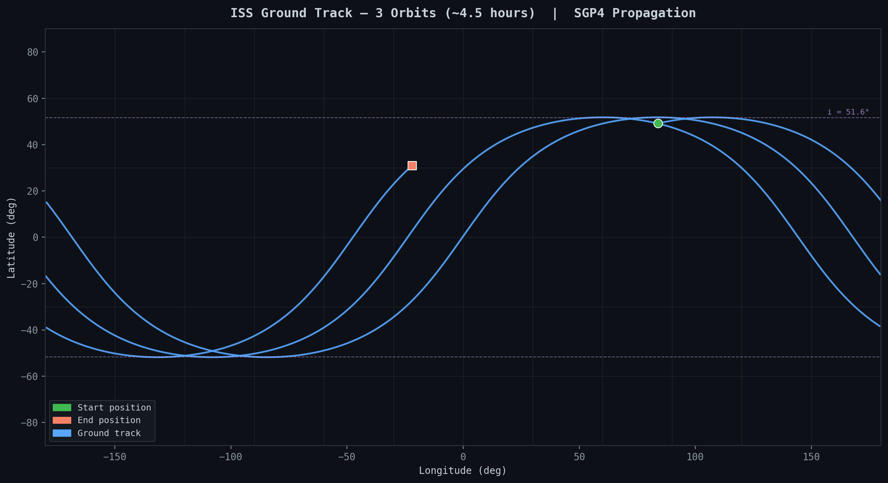
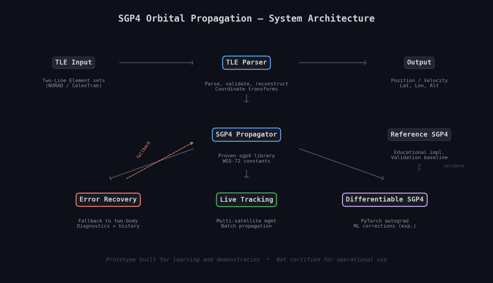
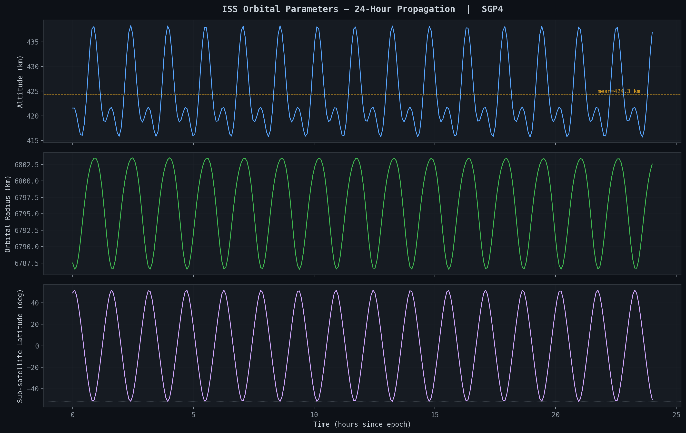
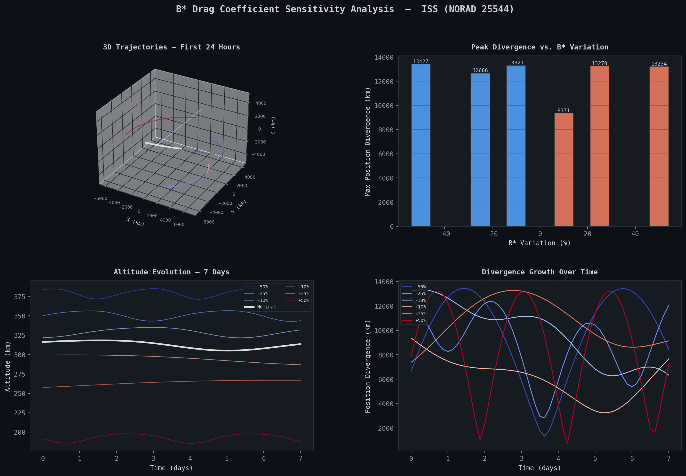

# SGP4 Orbital Propagation Prototype

A Python-based engineering prototype for satellite orbit prediction using the SGP4 (Simplified General Perturbations 4) model. Built to understand orbital mechanics from first principles: parsing TLE data, propagating satellite state vectors, handling edge cases with graceful fallback, and experimenting with differentiable propagation through PyTorch.

This is an application-based learning project. It demonstrates how the SGP4 algorithm works in practice, what its failure modes look like, and how to build engineering layers around it.


*ISS ground track over 3 orbits (~4.5 h). SGP4 propagation with TEME-to-geodetic transform.*

---

## What This Prototype Does

**Inputs:** Two-Line Element (TLE) sets, the standard format for satellite orbital data published by [NORAD](https://www.space-track.org/) and [CelesTrak](https://celestrak.org/).

**Outputs:** Satellite position and velocity vectors in multiple coordinate frames (TEME, ECEF, geodetic lat/lon/alt), sensitivity analysis, and error diagnostics.

**Core capabilities:**

| Capability | Module | Description |
|---|---|---|
| TLE parsing & reconstruction | `tle_parser.py` | Extract orbital elements, reconstruct TLE strings with modified parameters |
| SGP4 propagation | `sgp4_reference.py` | Educational reference implementation with numerical stability checks |
| Production tracking | `live_sgp4.py` | Multi-satellite management, batch propagation, error recovery |
| Error recovery | `two_body_fallback.py` | Automatic fallback to Keplerian propagation on SGP4 failure |
| Differentiable SGP4 | `differentiable_sgp4_torch.py` | PyTorch wrapper enabling gradient computation through propagation |
| Perturbation scanning | `perturbation_scanner.py` | Detect unexpected orbital changes from predicted vs. observed state |
| Coordinate transforms | `tle_parser.py` | TEME → ECEF → Geodetic (lat/lon/alt) with IAU 2000B GMST model |

---

## Architecture



The prototype is layered intentionally:

1. **TLE Parser** handles input validation, element extraction, and TLE reconstruction with checksum computation.
2. **SGP4 Propagator** delegates to the proven [`sgp4`](https://pypi.org/project/sgp4/) library for core propagation, using WGS-72 gravitational constants per [Vallado et al. (2006)](https://doi.org/10.2514/6.2006-6753).
3. **Error Recovery** provides a two-body Keplerian fallback when SGP4 fails (satellite decay, numerical instability, corrupted TLE data). See [Error Recovery Flow](#error-recovery).
4. **Differentiable SGP4** wraps propagation results in PyTorch tensors, enabling gradient-based analysis and an experimental ML correction network.

### Engineering choices and trade-offs

- **Proven library for core propagation, custom code for everything else.** The core SGP4 algorithm is well-validated in `sgp4==2.23` ([Rhodes](https://pypi.org/project/sgp4/)). Re-implementing it from scratch would risk bugs without adding value. The educational reference implementation (`sgp4_reference.py`) exists separately for learning purposes and cross-validation.
- **Fallback over failure.** When SGP4 produces an error (codes 1–6), the system falls back to two-body propagation rather than crashing. This is less accurate (no perturbations, no drag) but returns usable results with a clear warning flag. The trade-off: you get approximate answers instead of nothing, at the cost of needing to check `result['fallback_used']`.
- **Coordinate transforms done in-house.** TEME → ECEF uses the IAU 2000B GMST model with equation of equinoxes. ECEF → Geodetic uses Bowring's iterative method (converges in 2–3 iterations). These are straightforward enough to implement correctly and useful to understand.
- **PyTorch wrapper, not reimplementation.** The differentiable SGP4 wraps the proven library's output in tensors. This preserves accuracy while enabling gradient computation. The ML correction network is experimental; it demonstrates the concept of learned orbital corrections, not a trained model.

### Prototype constraints

- TLE data is not fetched live; the demos use hardcoded TLE sets.
- The reference SGP4 implementation handles near-Earth orbits only (period < 225 min). Deep-space propagation is not implemented.
- The differentiable wrapper uses a forward-difference approximation for gradients through the external SGP4 call. True end-to-end differentiability would require reimplementing SGP4 in PyTorch; see [ESA's dSGP4](https://github.com/esa/dSGP4) for that approach.
- No real-time data pipeline. This is a computation prototype, not a tracking service.

---

## Sample Outputs

### 24-Hour ISS Propagation


*Altitude, orbital radius, and sub-satellite latitude over 24 h. ~16 cycles at the ISS's ~92 min period; mean altitude ~424 km.*

### B* Drag Sensitivity Analysis


*B* varied ±10% to ±50% over 7 days. Small drag-coefficient changes compound into km-scale position divergence.*

### Error Recovery Flow


*On SGP4 error, the system logs diagnostics and optionally falls back to two-body propagation.*

See [ERROR_RECOVERY.md](ERROR_RECOVERY.md) for detailed documentation on error codes, diagnostics, and fallback behavior.

---

## Project Structure

```
SGP4/
├── orbit_service/                  # Core package
│   ├── tle_parser.py               # TLE parsing, reconstruction, coordinate transforms
│   ├── sgp4_reference.py           # Educational SGP4 implementation (Vallado et al.)
│   ├── live_sgp4.py                # Production-style tracking with error recovery
│   ├── two_body_fallback.py        # Keplerian fallback propagator
│   ├── differentiable_sgp4_torch.py  # PyTorch differentiable wrapper
│   └── perturbation_scanner.py     # Orbital perturbation detection
├── tests/
│   ├── test_sgp4_wrapper.py        # Differentiable SGP4 unit tests
│   ├── test_error_recovery.py      # Fallback and diagnostics tests
│   └── test_validation_suite.py    # Validation against published reference values
├── demo.py                         # Main demo: TLE parsing, propagation, B* analysis
├── demo_error_recovery.py          # Error recovery demonstration
├── generate_assets.py              # Generates all visual assets in assets/
├── config.py                       # WGS-72 constants and fallback TLE data
├── logging_config.py               # Centralized logging setup
├── assets/                         # Generated plots and diagrams
└── requirements.txt
```

---

## Getting Started

```bash
git clone https://github.com/ruddro-roy/SGP4.git
cd SGP4
pip install -r requirements.txt
```

**Requirements:** Python 3.8+, sgp4 ≥ 2.23, numpy ≥ 1.26.2, matplotlib ≥ 3.8.2. PyTorch ≥ 2.2.0 is needed only for the differentiable wrapper.

### Run the demos

```bash
python demo.py                        # TLE parsing and propagation
python demo.py --sensitivity          # B* drag sensitivity analysis (generates plot)
python demo_error_recovery.py         # Error recovery and fallback demonstration
```

### Run the tests

```bash
python -m pytest tests/ -v
```

### Regenerate visual assets

```bash
python generate_assets.py             # Outputs to assets/
```

---

## Usage Examples

### Parse a TLE and propagate

```python
from orbit_service.tle_parser import TLEParser

parser = TLEParser()
tle_data = parser.parse_tle(line1, line2, name="ISS")

# Propagate 90 minutes forward
result = parser.propagate_orbit(tle_data, tsince_minutes=90.0)
print(f"Lat: {result['latitude_deg']:.2f}°, Lon: {result['longitude_deg']:.2f}°")
print(f"Alt: {result['altitude_km']:.1f} km")
```

### Propagate with automatic error recovery

```python
from orbit_service.live_sgp4 import LiveSGP4

sgp4 = LiveSGP4(enable_fallback=True)
norad_id = sgp4.load_satellite(line1, line2, "ISS")
result = sgp4.propagate(norad_id, timestamp)

if result['fallback_used']:
    print(f"Fallback active: {result['fallback_warning']}")
```

### Differentiable propagation (PyTorch)

```python
from orbit_service.differentiable_sgp4_torch import DifferentiableSGP4
import torch

dsgp4 = DifferentiableSGP4(line1, line2)
tsince = torch.tensor(360.0, requires_grad=True)
position, velocity = dsgp4(tsince)

loss = torch.norm(position)
loss.backward()
print(f"Gradient w.r.t. time: {tsince.grad}")
```

---

## Validation

The test suite validates against published reference values from the astrodynamics literature:

- **Vallado et al. (2006)** test cases: 5 reference satellites with known position/velocity at epoch ([AIAA 2006-6753](https://doi.org/10.2514/6.2006-6753))
- **Edge cases:** high eccentricity, critical inclination (63.4°), sun-synchronous, Molniya, geostationary, and decaying orbits
- **Cross-implementation consistency:** results compared across four propagation paths (proven library, reference implementation, live tracker, differentiable wrapper)
- **Accuracy targets:** < 2 km position error for LEO, < 10 km for deep space, < 20 km for edge cases
- **Conservation properties:** two-body fallback tested for energy and angular momentum conservation

---

## Background and Context

This project is part of a set of space-related engineering prototypes that I started building after being accepted into the [Master's degree programme in Communications Engineering](https://www.polito.it/en/education/master-s-degree-programmes/communications-engineering) at [Politecnico di Torino](https://www.polito.it/en/education/master-s-degree-programmes) for the 2025/2026 session. The work was motivated by an interest in satellite communications, orbital mechanics, and the intersection of signal propagation with spacecraft dynamics.

Due to a visa rejection, the programme did not proceed, and this repository is not being actively maintained. I have since moved on to other projects. The code here represents the state of the work at the time it was paused: functional, tested, and demonstrative of the concepts, but not polished for production deployment.

I am keeping the repository public as a portfolio artifact because it reflects genuine engineering effort and understanding of the domain.

---

## References and Acknowledgements

### Core references

- Vallado, D. A., Crawford, P., Hujsak, R., & Kelso, T. S. (2006). [Revisiting Spacetrack Report #3](https://doi.org/10.2514/6.2006-6753). AIAA 2006-6753.
- Hoots, F. R., & Roehrich, R. L. (1980). *Models for Propagation of NORAD Element Sets.* Spacetrack Report No. 3.
- Vallado, D. A. (2013). *Fundamentals of Astrodynamics and Applications* (4th ed.). Microcosm Press.

### Related work in differentiable and improved SGP4

- Acciarini, G., et al. (2024). [Closing the Gap Between SGP4 and High-Precision Propagation via Differentiable Programming](https://doi.org/10.1016/j.actaastro.2024.10.063). *Acta Astronautica*.
- ESA dSGP4: [github.com/esa/dSGP4](https://github.com/esa/dSGP4), a differentiable SGP4 implementation in PyTorch.
- Pita Leira, A. [SGP4 in Non-Singular Variables](https://indico.esa.int/event/111/contributions/292/attachments/436/481/82_PitaLeira_Paper.pdf). ESA.
- San-Juan, J. F., et al. (2017). [Hybrid SGP4 Orbit Propagator](https://doi.org/10.1016/j.actaastro.2017.04.015). *Acta Astronautica*.
- Vallado, D. A., & Cefola, P. J. (2008). [SGP4 Orbit Determination](https://arc.aiaa.org/doi/10.2514/6.2008-6770). AIAA 2008-6770.
- Levit, C., & Marshall, W. (2010). [Improved Orbit Predictions Using Two-Line Elements](https://arxiv.org/abs/1002.2277). arXiv:1002.2277.
- Kozhemiakin, A. (2019). [Improving SGP4 Orbit Propagation](https://doi.org/10.34185/1562-9945-6-125-2019-07). *System Technologies*.

### Related ESA projects

- [ESA LADDS](https://github.com/esa/LADDS), large-scale deterministic debris simulation.
- [ESA cascade](https://github.com/esa/cascade), n-body simulation for orbital environment evolution.

### Tools and libraries

- Brandon Rhodes, [`sgp4`](https://pypi.org/project/sgp4/) Python library (v2.23+)
- [CelesTrak](https://celestrak.org/), public TLE data source.
- [Space-Track.org](https://www.space-track.org/), NORAD TLE distribution.

---

## Disclaimer

This is an engineering prototype built for learning and demonstration. It is **not** certified for operational orbit determination, collision avoidance, or any safety-critical application. Use at your own discretion.

## License

License selection is pending.
